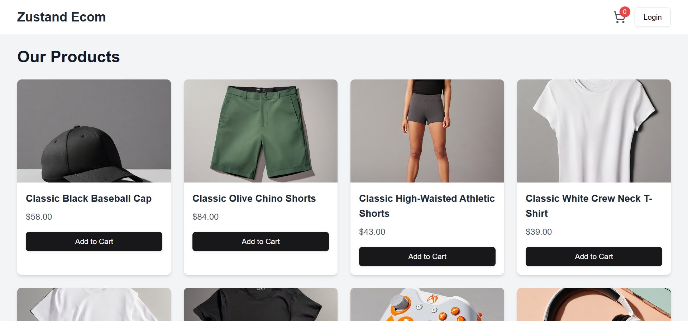

<div align="center">
<br/>

<br/>
  <div>
    
    
    

  </div>

<h3 align="center">State Management with Zustand</h3>

<div align="center">
  <a href="https://zustand-estore.vercel.app/">🌐View live demo🌐</a>
</div>
  
</div>

## 📋 <a name="table">Table of Contents</a>

1. 🤖 [Introduction](#introduction)
2. ⚙️ [Tech Stack](#tech-stack)
3. 🔋 [Features](#features)
4. 🤸 [Quick Start](#quick-start)


## <a name="introduction">🤖 Introduction</a>

A Next.js 14 state management example using Zustand. The example showcases how to manage the cart state in a Next.js application using Zustand.


## <a name="tech-stack">⚙️ Tech Stack</a>

- React 18
- Next.js 14
- TailwindCSS
- TypeScript

## <a name="features">🔋 Features</a>

👉 **Zustand Store**: Manage and persist the cart state using the custom Zustand store `store/cartStore.ts`.

👉 **Add**: the quantity of items in the cart..

👉 **Remove**: the quantity of items in the cart.

👉 **Update**: the quantity of items in the cart.

👉 **Persist Cart state**: Items in the cart are persisted even when navigating across pages.

👉 **Minimalistic Design**: Fresh and simple UI with only the essential pages for ease of use and a clean aesthetic.

## <a name="quick-start">🤸 Quick Start</a>

Follow these steps to set up the project locally on your machine.

**Prerequisites**

Make sure you have the following installed on your machine:

- [Git](https://git-scm.com/)
- [Node.js](https://nodejs.org/en)
- [npm](https://www.npmjs.com/) (Node Package Manager)

**Cloning the Repository**

```bash
git clone https://github.com/0ddFl3xx/zustand-state-management.git
cd zustand-state-management
```

**Installation**

Install the project dependencies using npm:

```bash
npm install 
```

**Running the Project**

```bash
npm run dev
```

Open [http://localhost:3000](http://localhost:3000) in your browser to view the project.
